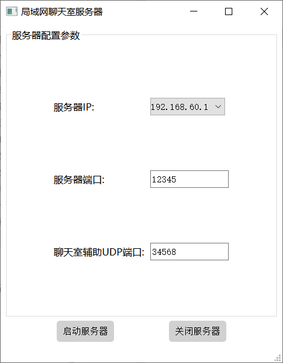
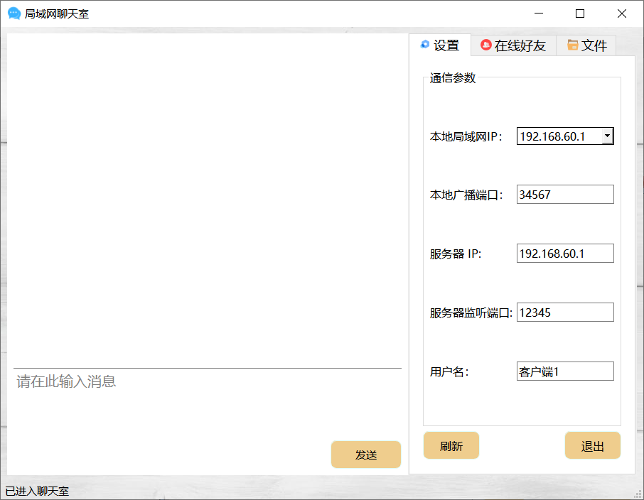
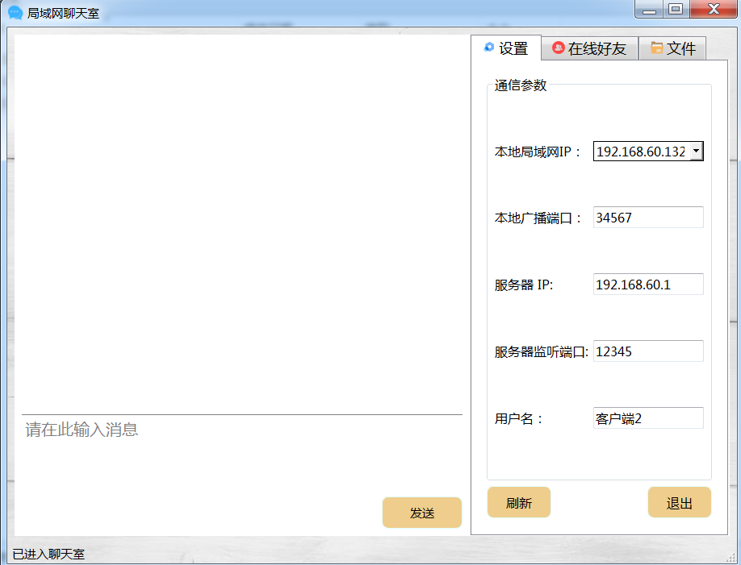
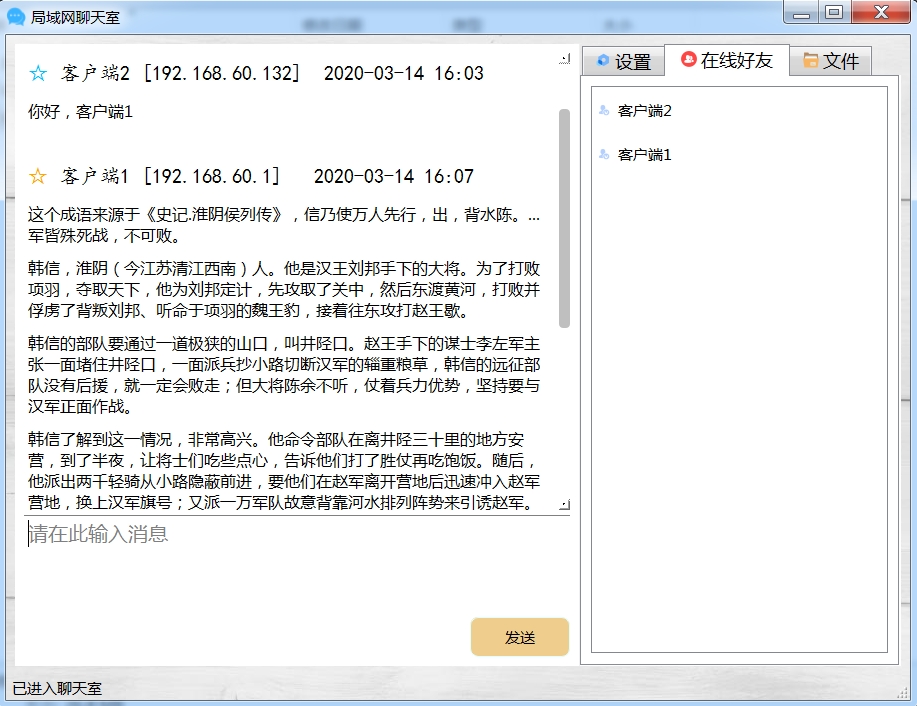
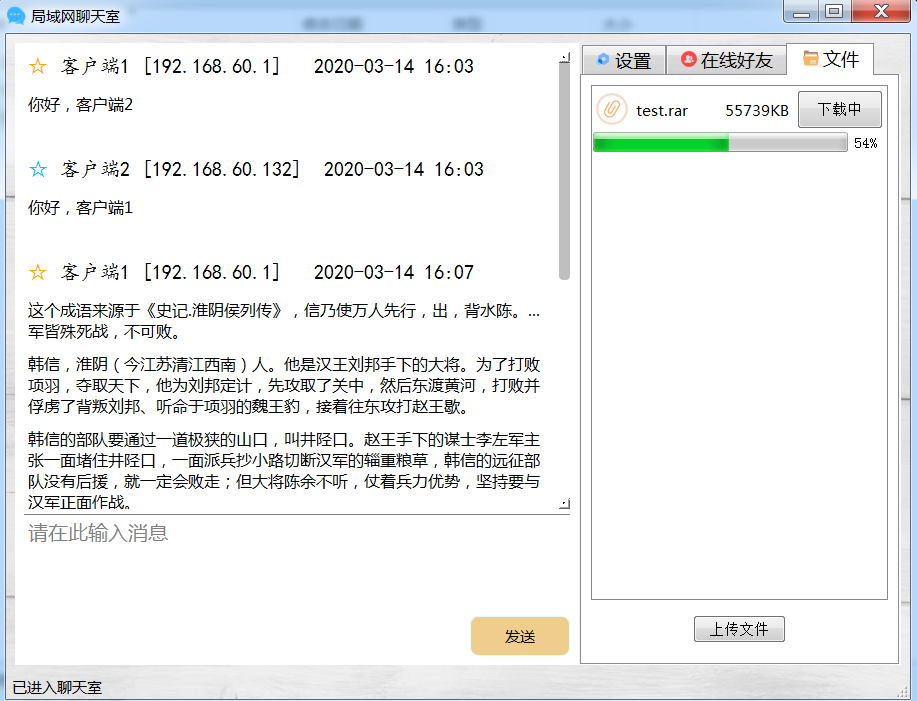

# 局域网广播聊天室

+ 网络工程师综合训练项目
+ 日期：2020年3月

## 基本介绍

基于`winsock2 API`设计并实现了一个局域网广播聊天室。基本功能如下：

（1）多客户端在局域网聊天室内进行文字消息聊天

（2）客户端查看在线好友列表

实现以上功能主要使用了UDP的广播和单播技术，并选择了winsock2 IO模型中的异步选择模型提高软件运行效率。

增加了服务器端拓展实现了简单的单线程TCP文件上传和下载功能。拓展实现的基本功能如下：

（1）客户端上传和下载文件

（2）客户端实时查看服务器文件列表

为了实现以上功能，服务器端使用了winsock2 IO模型中的重叠IO+IOCP完成端口模型，用于提高服务器端性能。

## 文件夹说明

| 文件夹名       | 说明               |
| -------------- | ------------------ |
| ChatRoom       | 客户端项目         |
| ChatRoomServer | 服务器端项目       |
| dist           | 打包后的可执行文件 |

## 开发工具与环境

**系统平台：**Win10 1903 64位

**开发语言：**C++

**开发工具：**Qt Creator 4.11.0 Based on Qt 5.14.0

**编译器版本：**MinGW 7.3.0 64bit 

## 功能展示

## 实验环境

+ 客户端1：win10 1903
+ 客户端2：虚拟机中的win7
+ 服务器端：win10 1903, 与客户端1在同一台PC

## 功能

局域网广播聊天室功能如下：

（1）文字消息聊天：客户端用户在同一局域网内文字聊天。

（2）查看在线用户列表：客户端用户查看同一聊天室内所有用户名和ip。

（3）文件上传和下载：客户端支持同时上传和下载一个文件。

（4）查看文件列表：客户端用户查看服务器端的所有文件。

### 启动服务器端

### 启动客户端和功能演示

## 其他说明

1. 传输的文件暂不支持中文路径和文件名

2. 文件传输出现的问题

   如果客户端和服务器端不处于同一主机中，客户端上传文件会出现停顿的情况，客户端下载文件速度较慢，存在bug。

3. 同一主机只能打开一个客户端（多开端口冲突）